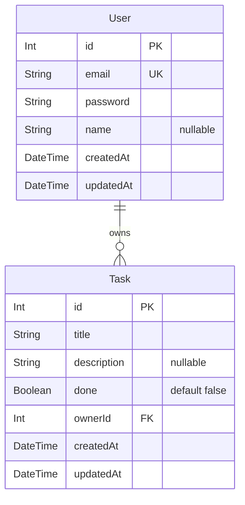

# To-Do

A full-stack task manager with per-user accounts and JWT authentication. A NestJS + Prisma REST API on the back, a React + Vite + Tailwind SPA on the front.

Every task belongs to an owner, and the API enforces that ownership on every read and write — you only ever see and modify your own tasks.

---

## Tech stack

| Layer | Stack |
| --- | --- |
| **Backend** | NestJS 10, TypeScript, Prisma 5, SQLite |
| **Auth** | Passport JWT (`passport-jwt`), bcrypt password hashing |
| **Validation** | `class-validator` / `class-transformer` via a global `ValidationPipe` |
| **Frontend** | React 18, TypeScript, Vite 7, Tailwind CSS 3, React Router 6 |
| **Tests** | Jest (backend service specs) |

## Features

- **Register / login** with email + password; passwords are bcrypt-hashed, never stored or returned in plaintext.
- **JWT-protected task API** — every `/api/tasks` route sits behind an auth guard.
- **Per-user data isolation** — tasks are scoped to the authenticated user's id, so one account cannot read or mutate another's tasks.
- **Full task CRUD** plus a `done` filter for listing only completed or only open tasks.
- **Strict request validation** — unknown body fields are rejected outright (`whitelist` + `forbidNonWhitelisted`), with field-level error messages.
- **Protected frontend routes** — `/dashboard` redirects to login when no token is present.
- **Seed script** that creates a demo user and sample tasks for instant local testing.

---

## Project structure

```
.
├── backend/                  # NestJS REST API
│   ├── prisma/
│   │   ├── schema.prisma     # User + Task models
│   │   ├── migrations/       # SQL migration history
│   │   └── seed.ts           # Demo user + sample tasks
│   └── src/
│       ├── auth/             # Register/login, JWT strategy, DTOs
│       ├── tasks/            # Controller, service, repository, DTOs
│       ├── users/            # User lookup + creation
│       ├── prisma/           # PrismaService (DB connection)
│       ├── common/           # JwtAuthGuard, HttpExceptionFilter
│       └── main.ts           # Bootstrap: CORS, /api prefix, validation
└── frontend/                 # React SPA
    └── src/
        ├── pages/            # Login, Register, Dashboard
        ├── components/       # ProtectedRoute, TaskItem
        └── services/api.ts   # Typed API client + token handling
```

The backend follows a **controller → service → repository** split: controllers handle HTTP and auth context, services hold business rules and ownership checks, repositories own all Prisma calls.

---

## Getting started

### Prerequisites

- **Node.js 20.19+** (or 22.12+) — required by Vite 7
- **npm**

### 1. Backend

```bash
cd backend
npm install

# create your env file from the template
cp .env.example .env
```

Open `.env` and set the values you need (see [Environment variables](#environment-variables)). For the default SQLite setup:

```env
DATABASE_URL="file:./dev.db"
JWT_SECRET="<a long random string of your own>"
JWT_EXPIRES_IN="3600s"
PORT=3000
```

Then set up the database and start the server:

```bash
npm run prisma:generate    # generate the Prisma client
npm run prisma:migrate     # apply migrations
npm run prisma:seed        # optional: demo user + sample tasks
npm run start:dev          # http://localhost:3000/api
```

### 2. Frontend

In a second terminal:

```bash
cd frontend
npm install
npm run dev                # http://localhost:5173
```

Open **http://localhost:5173** and register an account — or log in with the seeded demo user:

| Email | Password |
| --- | --- |
| `test@example.com` | `password123` |

> The backend's CORS policy allows `http://localhost:5173` only, and the frontend calls `http://localhost:3000/api`. If you change either port, update `backend/src/main.ts` and `frontend/src/services/api.ts` to match.

---

## Environment variables

Backend only — configured in `backend/.env`.

| Variable | Description | Example |
| --- | --- | --- |
| `DATABASE_URL` | Prisma connection string. The active schema provider is `sqlite`. | `file:./dev.db` |
| `JWT_SECRET` | Signing key for access tokens. Use a long, random, secret value. | — |
| `JWT_EXPIRES_IN` | Token lifetime. Defaults to `3600s` if unset. | `3600s` |
| `PORT` | API port. Defaults to `3000` if unset. | `3000` |

`backend/.env` is for local secrets and should never be committed. Keep `.env.example` as the documented template instead.

---

## API reference

Base URL: `http://localhost:3000/api`

### Auth

| Method | Endpoint | Body | Returns |
| --- | --- | --- | --- |
| `POST` | `/auth/register` | `email`, `password`, `name?` | `201` — `{ user, accessToken }` |
| `POST` | `/auth/login` | `email`, `password` | `200` — `{ user, accessToken }` |

Validation rules: `email` must be a valid address; `password` is 6–50 characters; `name` is optional, max 100 characters.

### Tasks

All task routes require an `Authorization: Bearer <accessToken>` header.

| Method | Endpoint | Body / Query | Returns |
| --- | --- | --- | --- |
| `GET` | `/tasks` | `?done=true` / `?done=false` (optional) | `200` — array of tasks |
| `GET` | `/tasks/:id` | — | `200` — single task |
| `POST` | `/tasks` | `title`, `description?` | `201` — created task |
| `PUT` | `/tasks/:id` | `title?`, `description?`, `done?` | `200` — updated task |
| `DELETE` | `/tasks/:id` | — | `204` — no content |

Validation rules: `title` is required on create, max 200 characters; `description` is optional, max 1000 characters; `done` is a boolean.

### Example

```bash
# register and capture the token
TOKEN=$(curl -s -X POST http://localhost:3000/api/auth/register \
  -H 'Content-Type: application/json' \
  -d '{"email":"me@example.com","password":"secret123","name":"Me"}' \
  | python3 -c 'import sys,json; print(json.load(sys.stdin)["accessToken"])')

# create a task
curl -X POST http://localhost:3000/api/tasks \
  -H "Authorization: Bearer $TOKEN" \
  -H 'Content-Type: application/json' \
  -d '{"title":"Write the README","description":"Document the API"}'

# list only open tasks
curl "http://localhost:3000/api/tasks?done=false" \
  -H "Authorization: Bearer $TOKEN"
```

---

## Data model



Deleting a user cascades to their tasks (`onDelete: Cascade`).

---

## Testing

```bash
cd backend
npm test              # run the Jest suite
npm run test:watch    # watch mode
npm run test:cov      # coverage report
```

Current specs cover the auth and tasks services (`backend/test/`).

---

## Scripts

### Backend

| Script | Purpose |
| --- | --- |
| `npm run start:dev` | Start with hot reload |
| `npm run start:prod` | Run the compiled build (`dist/main`) |
| `npm run build` | Compile TypeScript |
| `npm run lint` | ESLint with `--fix` |
| `npm run format` | Prettier over `src/` and `test/` |
| `npm run prisma:generate` | Regenerate the Prisma client |
| `npm run prisma:migrate` | Create/apply a dev migration |
| `npm run prisma:seed` | Seed the demo data |
| `npm run prisma:studio` | Open Prisma Studio |

### Frontend

| Script | Purpose |
| --- | --- |
| `npm run dev` | Vite dev server |
| `npm run build` | Type-check then production build |
| `npm run preview` | Preview the production build |
| `npm run lint` | ESLint over `.ts` / `.tsx` |

---

## Notes and known rough edges

- **Tokens live in `localStorage`** (key: `token`). Convenient across refreshes, but readable by any script on the page. A memory-only token or an httpOnly refresh-cookie flow would be the hardening step.
- **Id types disagree across the stack.** Prisma/SQLite uses integer ids, while `frontend/src/services/api.ts` types `id` as `string`. It works at runtime through JSON coercion, but the frontend types should be `number`.
- **The Prisma schema mentions MongoDB** in its header comment, but the active provider is `sqlite`. Switching to MongoDB would require changing the provider and the `@id` field types.
- **No refresh tokens.** `generateTokens()` issues an access token only; when it expires the user logs in again.
- **Hardcoded URLs.** API base URL and CORS origin are literals rather than environment-driven — worth moving to env vars before any real deployment.

## License

MIT — see `backend/package.json`.
